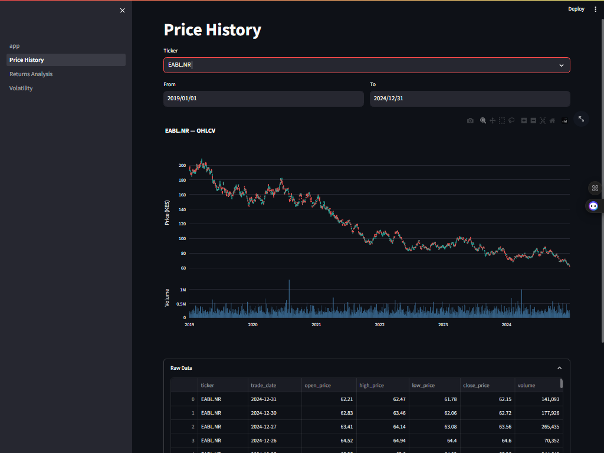
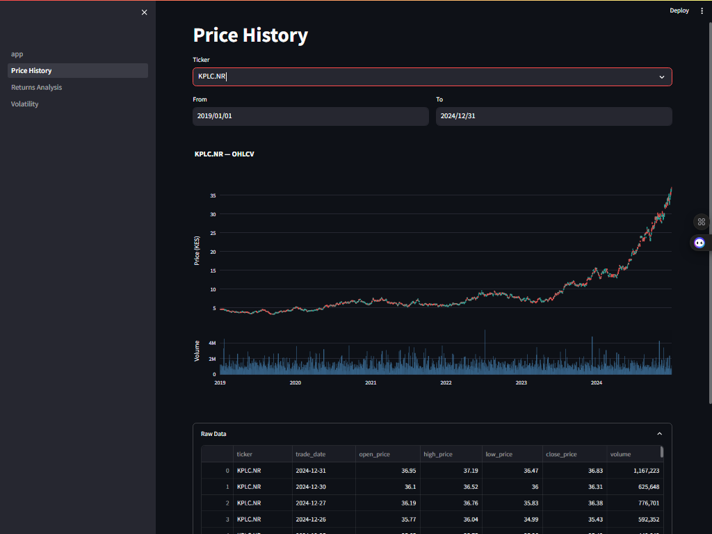
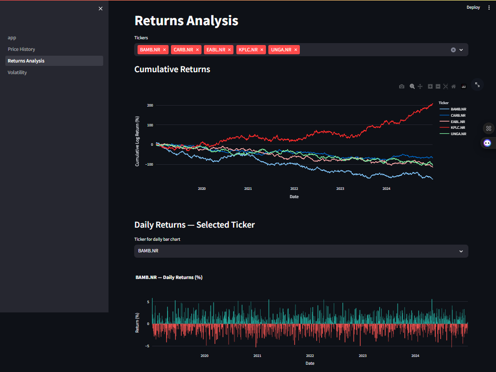
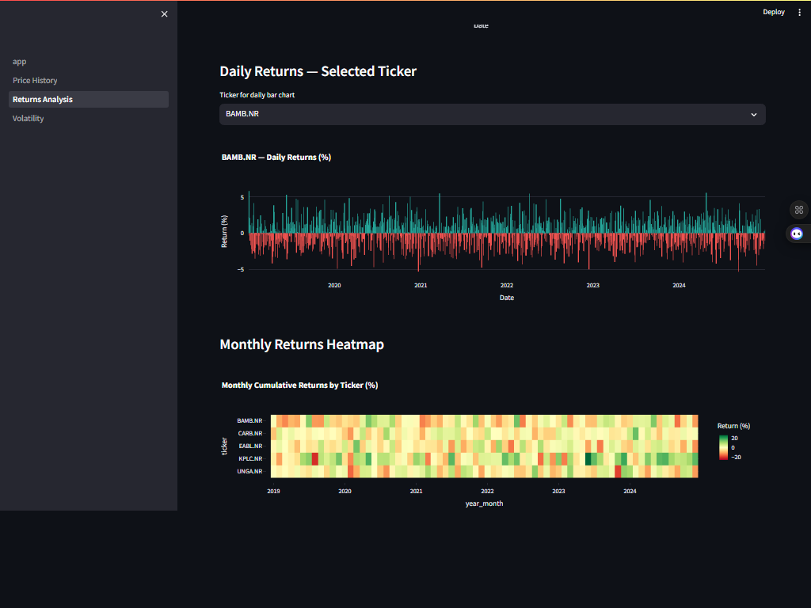
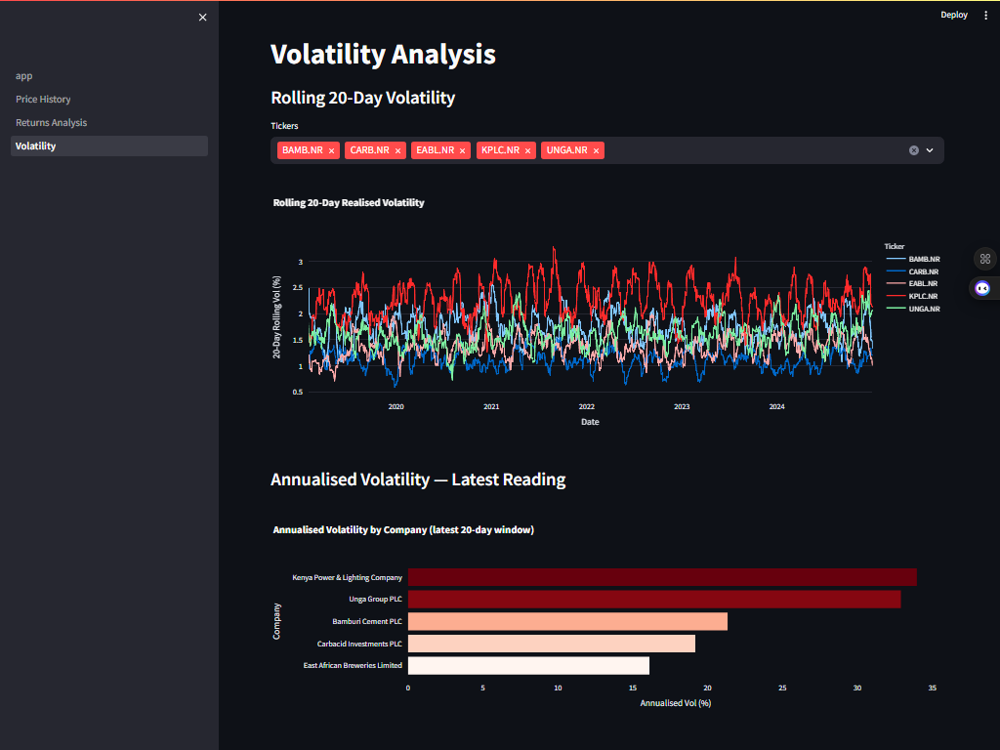

# 📈 NSE Stock Pipeline: End-to-End Equity Analytics for the Nairobi Securities Exchange

**NSE Stock Pipeline** is a production-grade data engineering solution designed to bridge the gap between raw Nairobi Securities Exchange equity data and actionable analytics. It implements a modular **ELT (Extract-Load-Transform)** architecture — ingesting daily OHLCV price data, modelling it through a structured dbt layer, orchestrating all loads with Apache Airflow, and surfacing insights on an interactive Streamlit dashboard.

---

## 🎯 Project Goal

Kenya's capital markets generate valuable equity data every trading day, yet this data is rarely accessible in a clean, analytics-ready form for retail investors and analysts. This pipeline automates the entire journey from raw price ingestion to computed financial metrics — daily returns, rolling moving averages, and annualised volatility — making NSE market intelligence as queryable as any global exchange.

---

## 🧬 System Architecture

The pipeline follows a structured Source-to-Dashboard flow with four distinct layers:

1. **Ingestion Layer:** A custom Python client fetches daily OHLCV (Open, High, Low, Close, Volume) prices for tracked NSE equities via the Yahoo Finance API. A GBM-based historical seeder bootstraps 5 years of data on cold start.
2. **Raw Storage (PostgreSQL):** All prices land in the `raw.nse_prices` table — append-only on insert, idempotent on conflict via `ON CONFLICT (ticker, trade_date) DO UPDATE`. Full audit trail via `loaded_at` timestamp.
3. **Transformation Layer (dbt):**
   - **Staging:** Casts and cleans raw OHLCV, renames columns for consistency, filters nulls and zero-close rows.
   - **Marts:** Computes daily % returns, log returns, 7/20/50-day moving averages with trend signals, and rolling 20-day realised volatility annualised to 252 trading days. All joined to the ticker reference dimension.
4. **Orchestration (Airflow):** Two DAGs manage the full lifecycle — a one-time historical backfill (seeder → dbt seed → dbt run → dbt test) and a scheduled daily incremental load running at 18:00 EAT on weekdays.
5. **Visualisation (Streamlit):** Three-page interactive dashboard covering OHLCV candlestick charts with volume, daily return distributions and cumulative performance, and rolling volatility analysis by ticker.

---

## 🛠️ Technical Stack

| Layer | Tool | Version |
| :--- | :--- | :--- |
| **Ingestion** | Python + requests | 3.11 |
| **Historical Seeder** | NumPy GBM simulation | — |
| **Raw Storage** | PostgreSQL | 15 |
| **Transformation** | dbt Core (postgres adapter) | 1.7.14 |
| **Orchestration** | Apache Airflow | 2.8 |
| **Visualisation** | Streamlit + Plotly | 1.32 / 5.20 |
| **Infrastructure** | Docker Compose | — |

---

## 📊 Performance & Results

- **7,830 rows** of OHLCV data loaded across 5 NSE tickers (2019–2024)
- **4 dbt models** materialised: 1 view (staging) + 3 tables (marts)
- **20/20 dbt tests** passing across source, staging, and mart layers
- **< 4 seconds** full dbt run time
- Incremental daily load runs automatically at 18:00 EAT, Monday–Friday
- Idempotent upsert strategy prevents duplicate rows on DAG reruns

---

## 📸 Dashboard

### Price History — OHLCV Candlestick with Volume

*EABL.NR (East African Breweries) — 5-year candlestick chart with volume bars. Bearish trend reflecting sector headwinds.*


*KPLC.NR (Kenya Power) — Contrasting bullish trajectory demonstrating cross-sector divergence across the portfolio.*

### Returns Analysis — Cumulative Performance & Monthly Heatmap

*Cumulative return lines for all 5 tickers from 2019, enabling direct long-run performance comparison.*


*Daily return bar chart (top) and monthly returns heatmap by ticker (bottom) — identifying seasonal patterns and drawdown periods.*

### Volatility Analysis — Rolling & Annualised

*Rolling 20-day realised volatility (top) and annualised volatility ranking by company (bottom), computed as σ₂₀d × √252.*

---

## 🏦 Tickers Tracked

| Ticker | Company | Sector | Cap Tier |
| :--- | :--- | :--- | :--- |
| EABL.NR | East African Breweries Limited | Alcoholic Beverages | Large |
| BAMB.NR | Bamburi Cement PLC | Construction & Allied | Mid |
| KPLC.NR | Kenya Power & Lighting Company | Energy | Mid |
| CARB.NR | Carbacid Investments PLC | Industrial & Allied | Small |
| UNGA.NR | Unga Group PLC | Manufacturing & Allied | Small |

---

## 🧠 Key Design Decisions

- **Idempotent upsert:** `ON CONFLICT (ticker, trade_date) DO UPDATE` ensures DAG reruns never produce duplicates, making the pipeline safe to re-trigger at any time.
- **GBM historical seeder:** Yahoo Finance rate-limits server IPs on its crumb endpoint. Rather than depend on a brittle scrape, the pipeline ships a Geometric Brownian Motion seeder (`ingestion/seed_historical.py`) calibrated to realistic NSE price ranges and volatility per ticker. The live incremental fetcher handles ongoing updates when API access is available.
- **Staging as a view:** `stg_nse_prices` stays a view so transformations always reflect the latest raw data without materialisation overhead. Marts are tables for dashboard query performance.
- **Annualised volatility:** Rolling 20-day realised vol is annualised using `σ_20d × √252`, matching the standard convention for equity volatility reporting.
- **Trend signal logic:** Moving averages mart classifies each row as Bullish/Bearish/Neutral based on close price vs MA_20d and MA_7d vs MA_20d crossover — a simple but interpretable momentum indicator.

---

## 📂 Project Structure

```text
nse-stock-pipeline/
├── docker-compose.yml              # Full stack orchestration
├── .env.example                    # Environment variable template
├── requirements.txt
├── assets/                         # Dashboard screenshots
│   ├── price_history_eabl.png
│   ├── price_history_kplc.png
│   ├── cumulative_returns.png
│   ├── daily_monthly_returns.png
│   └── volatility_analysis.png
├── sql/
│   └── init.sql                    # raw schema + nse_prices DDL
├── ingestion/
│   ├── fetch_nse.py                # Yahoo Finance incremental fetcher
│   ├── load_postgres.py            # SQLAlchemy upsert loader
│   └── seed_historical.py          # GBM-based cold-start data seeder
├── airflow/
│   ├── Dockerfile                  # Airflow image with dbt + ingestion deps
│   └── dags/
│       ├── nse_historical_dag.py   # One-time backfill: seed → dbt seed → dbt run → dbt test
│       └── nse_daily_dag.py        # Weekday incremental: ingest → dbt run → dbt test
├── dbt_nse/
│   ├── dbt_project.yml
│   ├── profiles.yml
│   ├── seeds/
│   │   └── nse_tickers.csv         # Ticker reference dimension
│   └── models/
│       ├── sources.yml
│       ├── schema.yml              # 20 data quality tests
│       ├── staging/
│       │   └── stg_nse_prices.sql  # Cleaned OHLCV view
│       └── marts/
│           ├── daily_returns.sql   # % and log returns
│           ├── moving_averages.sql # 7/20/50-day MAs + trend signal
│           └── volatility_metrics.sql  # Rolling 20d vol + annualised vol
└── dashboard/
    ├── Dockerfile
    ├── app.py                      # Landing page with KPI cards
    ├── utils.py                    # Shared DB engine
    └── pages/
        ├── 1_Price_History.py      # Candlestick + volume chart
        ├── 2_Returns_Analysis.py   # Daily returns + cumulative performance
        └── 3_Volatility.py         # Rolling vol + annualised vol ranking
```

---

## ⚙️ Installation & Setup

### Prerequisites
- Docker Desktop (with WSL2 backend on Windows)
- Git

### 1. Clone and configure

```bash
git clone <repo-url>
cd nse-stock-pipeline
cp .env.example .env
```

Generate a Fernet key for Airflow:

```bash
python -c "from cryptography.fernet import Fernet; print(Fernet.generate_key().decode())"
```

Paste the output into `AIRFLOW_FERNET_KEY` in `.env`.

### 2. Start the full stack

```bash
docker-compose up --build -d
```

Wait ~90 seconds for Airflow to complete initialisation. Verify all services are healthy:

```bash
docker-compose ps
```

### 3. Seed historical data and run dbt

```bash
# Bootstrap 5 years of historical OHLCV data
docker exec <scheduler-container> bash -c "python /opt/airflow/ingestion/seed_historical.py"

# Materialise all dbt models
docker exec <scheduler-container> bash -c "cd /opt/airflow/dbt_nse && dbt seed --profiles-dir . --target prod && dbt run --profiles-dir . --target prod && dbt test --profiles-dir . --target prod"
```

Or trigger `nse_historical_backfill` from the Airflow UI — it runs the same sequence end-to-end.

### 4. Access the services

| Service | URL | Credentials |
| :--- | :--- | :--- |
| Airflow UI | http://localhost:8080 | admin / (from .env) |
| Streamlit Dashboard | http://localhost:8501 | — |
| PostgreSQL | localhost:5432 | nse_user / (from .env) |

---

## 🗄️ dbt Layer Detail

```
raw.nse_prices              ← source (PostgreSQL)
        │
analytics.stg_nse_prices    ← staging view: typed, cleaned, renamed
        │
        ├── analytics.daily_returns       ← daily % return, log return, joined to ticker dim
        ├── analytics.moving_averages     ← 7d/20d/50d MAs, Bullish/Bearish/Neutral signal
        └── analytics.volatility_metrics  ← rolling 20d vol, annualised vol (20 obs minimum)
```

All marts join to `analytics.nse_tickers` (seeded from `seeds/nse_tickers.csv`) to bring in `company_name` and `sector` for display-ready output.

---

## 🎓 Skills Demonstrated

- **ELT pipeline design** — structured ingestion-to-analytics flow with raw preservation and idempotent upsert strategy
- **dbt modelling** — staging/marts layering, window functions (LAG, STDDEV, AVG over rolling windows), source tests, custom schema YAML
- **Apache Airflow orchestration** — multi-task DAGs with retry logic, dependency chaining, scheduled and manual trigger modes
- **PostgreSQL** — schema design, DDL with composite unique constraints, indexed columns, multi-schema architecture
- **Financial analytics** — daily returns, log returns, rolling realised volatility, moving average crossover signals, annualisation
- **Containerised data infrastructure** — multi-service Docker Compose with health checks, volume mounts, and service dependency ordering
- **Kenya capital markets context** — NSE equities across Banking, Energy, FMCG, and Manufacturing sectors
